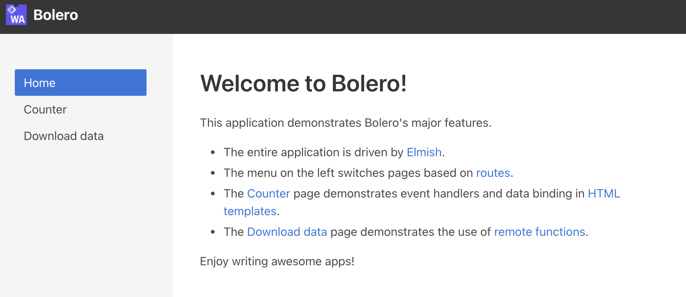
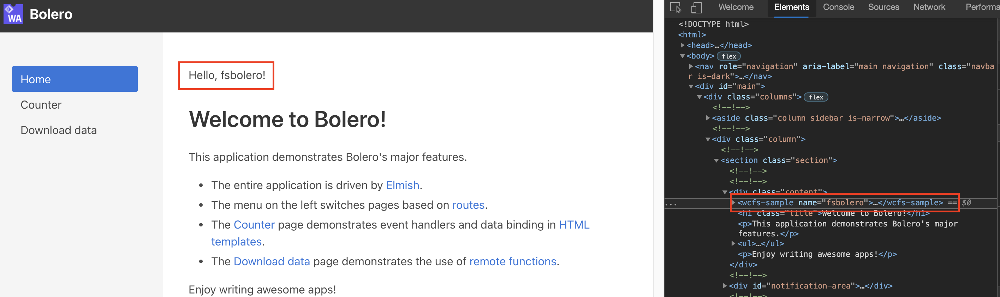

# Bolero WC Sample

Run with 
```
dotnet run -p WCSample.Server
```

when loading the page it should process any web component (since they work as any other html tag) but it doesn't show
 

after saving the file the web component actually shows
